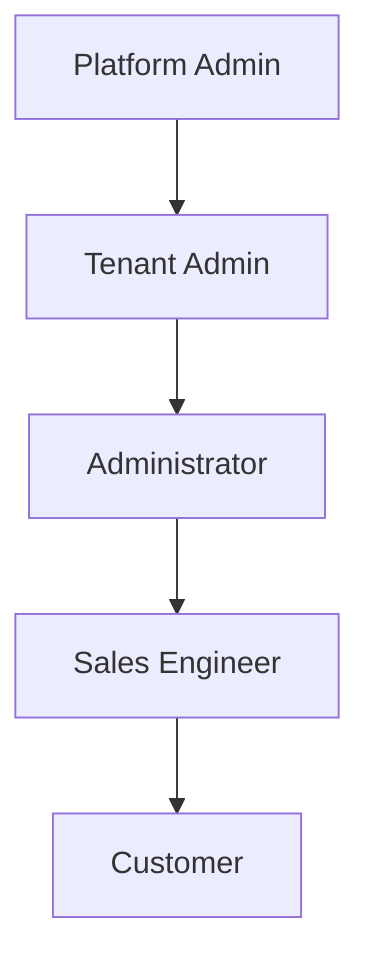

# User Roles

POC Manager uses role-based access control to manage permissions. Understanding your role is essential to using the platform effectively.

## Role Hierarchy

## Platform Admin

**Who**: System administrators who manage the entire platform

### Permissions
- ✅ Create and manage tenants
- ✅ View all tenant data
- ✅ Configure platform settings
- ✅ Access all features

### Common Tasks
- Creating new tenants
- Managing tenant subscriptions
- Platform configuration
- System monitoring

### Navigation Access
- Tenants page
- All dashboard features

[Learn more about Platform Admin tasks →](../platform-admin/tenants.md)

---

## Tenant Admin

**Who**: Administrators who manage a specific tenant organization

### Permissions
- ✅ Manage users within their tenant
- ✅ Invite new users (Administrators, Sales Engineers)
- ✅ Configure tenant settings
- ✅ Manage branding and integrations
- ❌ Cannot access other tenants

### Common Tasks
- Inviting and managing users
- Setting up integrations (Slack, Jira, etc.)
- Configuring tenant branding
- Managing tenant settings

### Navigation Access
- Users page
- Settings page
- Dashboard

[Learn more about Tenant Admin tasks →](../tenant-admin/users.md)

---

## Administrator

**Who**: Team members who create POC templates and manage the POC library

### Permissions
- ✅ Create and manage task templates
- ✅ Create and manage task group templates
- ✅ Add resources to templates
- ✅ View all POCs in their tenant
- ❌ Cannot manage users
- ❌ Cannot invite customers

### Common Tasks
- Creating reusable task templates
- Organizing task groups
- Adding resources (links, code, docs) to tasks
- Maintaining POC template library

### Navigation Access
- Task Templates page
- POCs page
- Dashboard

[Learn more about Administrator tasks →](../administrator/task-templates.md)

---

## Sales Engineer

**Who**: Team members who create and manage POC engagements with customers

### Permissions
- ✅ Create new POCs
- ✅ Invite customers to POCs
- ✅ Add and manage tasks
- ✅ Update task status
- ✅ Add comments (internal and external)
- ✅ Generate POC documents
- ✅ View and manage their POCs
- ❌ Cannot create task templates
- ❌ Cannot manage users

### Common Tasks
- Creating POCs for customer engagements
- Inviting customers to participate
- Managing tasks and tracking progress
- Adding resources and documentation
- Generating reports
- Communicating with customers

### Navigation Access
- POCs page
- POC detail pages
- Dashboard

[Learn more about Sales Engineer tasks →](../sales-engineer/poc-overview.md)

---

## Customer

**Who**: External users participating in a POC engagement

### Permissions
- ✅ View POC details
- ✅ View assigned tasks
- ✅ Add external comments
- ✅ Mark tasks as complete (from their perspective)
- ✅ View resources
- ✅ Generate POC documents
- ❌ Cannot edit POC details
- ❌ Cannot create tasks
- ❌ Cannot see internal comments
- ❌ Limited to their assigned POCs

### Common Tasks
- Viewing POC progress
- Providing feedback on tasks
- Adding comments
- Reviewing resources
- Completing assigned tasks

### Navigation Access
- POC view (read-only with comment capability)
- Dashboard (limited view)

[Learn more about Customer tasks →](../customer/viewing-pocs.md)

---

## Role Comparison

| Feature | Platform Admin | Tenant Admin | Administrator | Sales Engineer | Customer |
|---------|---------------|--------------|---------------|----------------|----------|
| Manage Tenants | ✅ | ❌ | ❌ | ❌ | ❌ |
| Manage Users | ✅ | ✅ | ❌ | ❌ | ❌ |
| Create Templates | ✅ | ✅ | ✅ | ❌ | ❌ |
| Create POCs | ✅ | ✅ | ✅ | ✅ | ❌ |
| Invite Customers | ✅ | ✅ | ✅ | ✅ | ❌ |
| Manage Tasks | ✅ | ✅ | ✅ | ✅ | ❌ |
| View POCs | ✅ | ✅ | ✅ | ✅ | Limited |
| Add Comments | ✅ | ✅ | ✅ | ✅ | External only |
| View Internal Comments | ✅ | ✅ | ✅ | ✅ | ❌ |

## Determining Your Role

To check your role:

1. Look at the navigation menu items available to you
2. Check your profile settings
3. Ask your tenant administrator

!!! tip "Need Different Permissions?"
    If you need access to features not available in your current role, contact your tenant administrator to discuss role changes.
